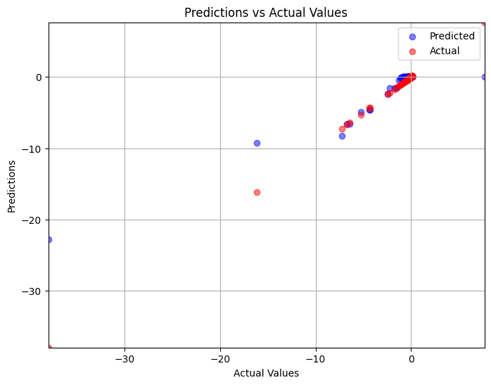
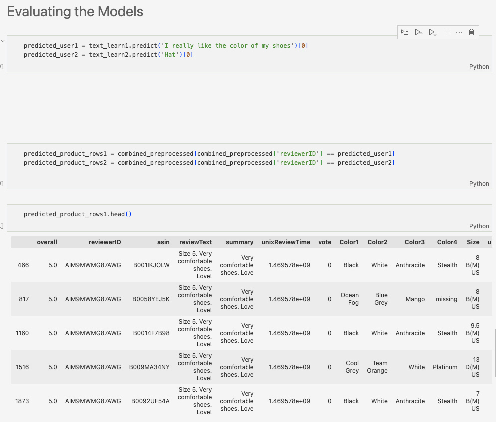
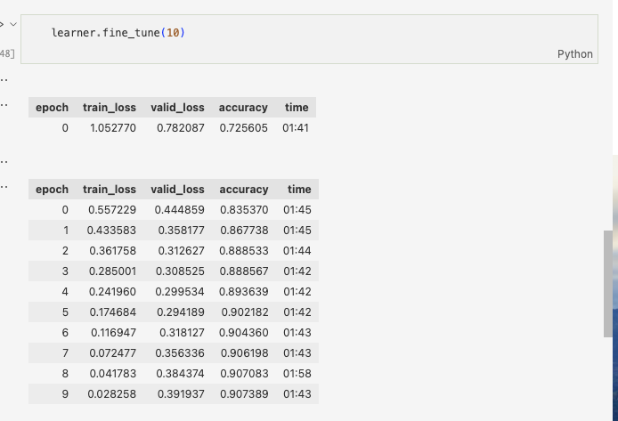

# Utilizing Fast AI's Computer Vision, Tabular and Text Models

In this section, I use Fast AI to create models trained on a variety of data to showcase the models ability on a variety of tasks.

## Tabular

Fast AI is used to implement regression on a tabular dataset where the 'X' features are buisiness' environmental impact indicators and the 'y' target is the monetized environmental impact of the firm's operations during the specific year as a percent of revenue.

## Text

Fast AI is used to implement a product recommendation task using a text in json dataset of Amazon fashion products. The 'X' is product reviews by user, and the 'y' is the products recommended based on user reviews.

## Vision

Fast AI is used to implement a computer vision model trained on the Fashion-MNIST dataset of images of black and white articles of clothing. The 'X' is the images, and the 'y' target is the clothing label.

