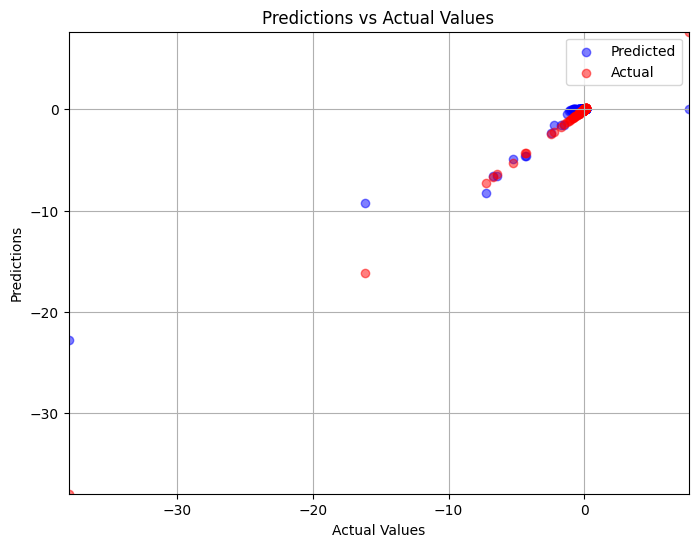

# Tabular
Fast AI is used in this section to implement regression on a tabular dataset where the 'X' features are buisiness' environmental impact indicators and the 'y' target is the monetized environmental impact of the firm's operations during the specific year as a percent of revenue.

