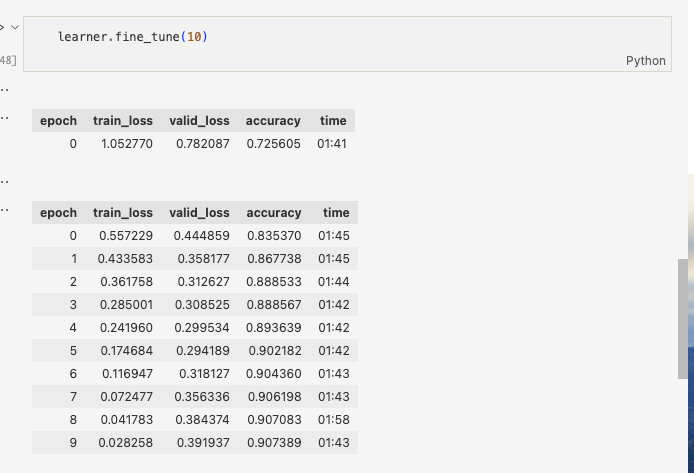

# Vision
Fast AI is used to implement a computer vision model trained on the Fashion-MNIST dataset of images of black and white articles of clothing. The 'X' is the images, and the 'y' target is the clothing label.

