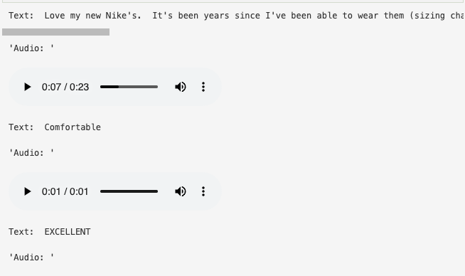

# HuggingFace Audio (Text to Speech)

In this section, I implemented an audio (text to speech) model using a pre-trained HuggingFace transformer audio model to translate text to simulated speech. For this section, I will be using data from the amazon fashion text dataset (the reviews feature has a good amount of natural speech text!).

