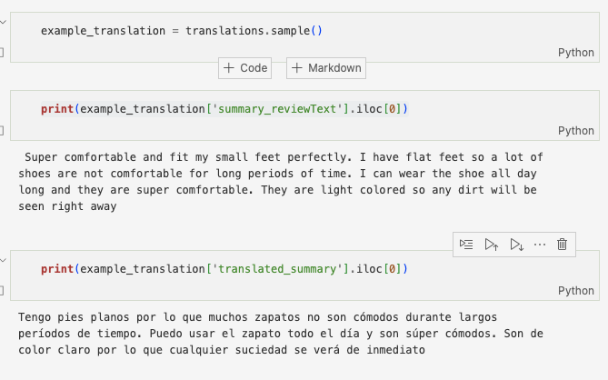
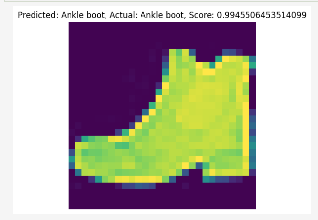

# HuggingFace

In this section, I implemented an audio (text to speech) model using a pre-trained HuggingFace transformer audio model to translate text to simulated speech. For this section, I will be using data from the amazon fashion text dataset (the reviews feature has a good amount of natural speech text!).

## Tabular

I use tabular data to create a custom classification model that uses  data environmental impact from a variety of buisness metrics.

## Audio

In this section, I implemented an audio (text to speech) model using a pre-trained HuggingFace transformer audio model to translate text to simulated speech. For this section, I used data from the amazon fashion text dataset (the reviews feature has a good amount of natural speech text!).

## Text
I build three variant text models, 
1. A named entity recognition model
2. A summarization model
3. A translation model

## Vision

I implement a zero shot object classification model using HuggingFace vision transformer models. I use the Fashion-MNIST dataset for this section.

