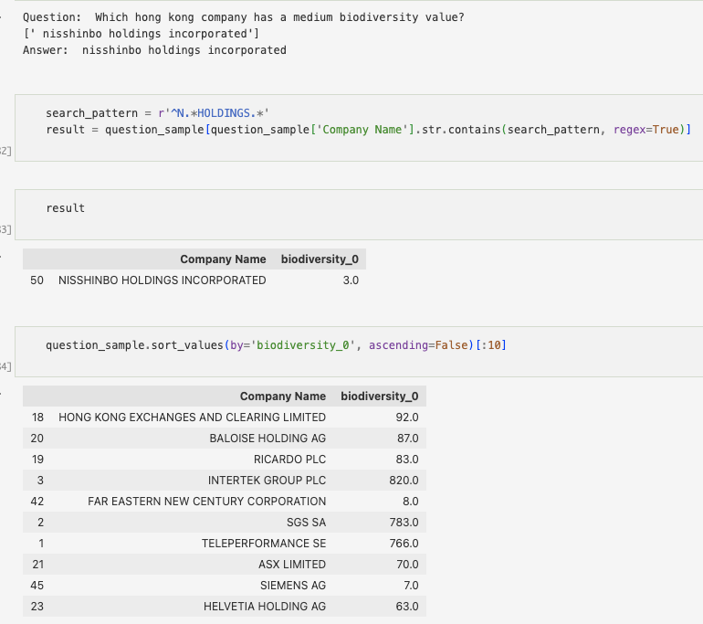

## Tabular

In this section I use tabular data (data about environmental cost of corporations by a variety of environmental and revenue metrics) to create a custom text model that can answer questions using natural language processing techniques.

