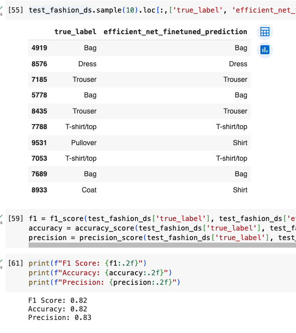
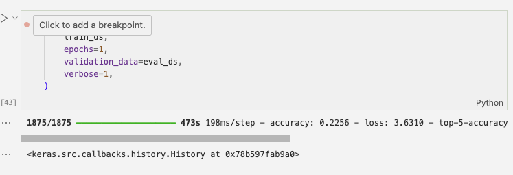

# Keras CV (Computer Vision)

Keras also has useful CV tools that can help build a state-of-the-art YOLO (You Only Look Once) object detection model. The YOLO architecture helps speed up object detection for example, when using in a video setting where many frames are being analyzed per second.

I build two classifiers (a pretrained classifier, train my own custom classifier) and then test the pre-trained classifier by fine-tuning it on grey-scale images of articles of clothing.

## Pre-Trained Vision Model using Keras
In this section, I finetuned a pre-trained vision model (that was NOT trained to classify images of clothing) using the Fashion-MNIST dataset of images.

## Custom Vision Model using Keras
I trained my own custom Keras model to classify fashion / articles of clothing from the Fashion-MNIST set. 

